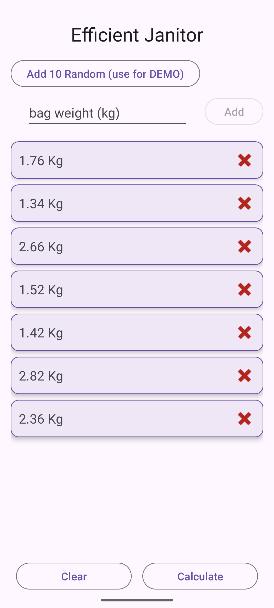
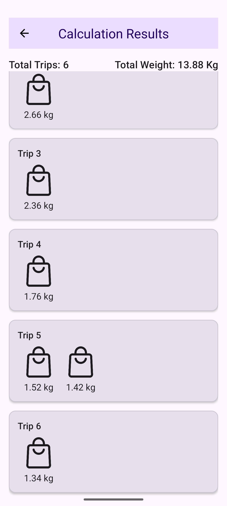

# EfficientJanitor

EfficientJanitor is a simple Android application that helps calculate the minimum number of trips required to carry garbage bags, based on their weights. The user inputs the weights of garbage bags, and the app efficiently groups them into trips, each with a weight limit of up to 3 kg.

## Screenshots

### Bags Screen


### Result Screen


## Features

- ✅ Add individual bags by weight (manual input)
- ✅ Add 10 random bags (within allowed weight range)
- ✅ View list of entered bags
- ✅ Remove individual bags
- ✅ Clear all bags
- ✅ Calculate trips using an efficient algorithm
- ✅ Show trips in a separate results screen
- ✅ Animated fragment transition
- ✅ Validations with snackbars
- ✅ Persistent bag storage using Room
- ✅ State management using ViewModel and StateFlow
- ✅ UI state preservation
- ✅ Constants for min/max bag weight
- ✅ Responsive UI with enabled/disabled buttons based on state
- ✅ Organized package structure
- ✅ Dark/Light mode support

## Technology Stack

- **Kotlin**
- **MVVM architecture**
- **Room** for local persistence
- **ViewModel** + **StateFlow**
- **Hilt** for Dependency Injection
- **Material 3 UI**
- **ViewBinding**
- **Manual FragmentManager-based navigation** (not Navigation Component)
- **ConstraintLayout**
- **Unit tests**

## Algorithm

The algorithm used to calculate the minimal number of trips is:

### First Fit Decreasing (FFD)

- It is a greedy approximation algorithm.
- The bags are first sorted in descending order by weight.
- Each bag is placed into the first trip that has enough remaining capacity.
- If no existing trip can accommodate it, a new trip is created.
- The maximum weight per trip is 3.0 kg.

This algorithm is not guaranteed to find the absolute minimum number of trips, but it is efficient and provides a very good approximation, making it well-suited for real-time mobile applications.

## Constants

To avoid hard-coded values, the app defines global constants:

```kotlin
const val MIN_BAG_WEIGHT = 1.01
const val MAX_BAG_WEIGHT = 3.0
```

These are used throughout the app for input validation and UI messages.

## Project Structure

The app follows a clean modular package structure:

```
com.eranio.efficientjanitor
│
├── data            // Room DB, DAO, repository
├── di              // Hilt modules
├── domain          // Interfaces and core business logic (TripsCalculator, BagRepository)
├── ui              // Fragments and UI state
├── util            // Constants and utility functions
├── viewmodel       // ViewModel and UI logic
└── EfficientJanitorApp.kt // Application class
```

## Persistence (Room)

- **Entity**: `BagEntity`
- **DAO**: `BagDao` with `insert`, `delete`, `clear`, and `getAll`
- **Database**: `AppDatabase`
- **Repository**: `RoomBagRepository` implementing `BagRepository`
- Bags are saved to the local database and collected via `Flow`.

## UI State

The app uses:
- `StateFlow<JanitorUiState>` to hold UI data.
- `Channel<UiEvent>` for one-time events like Snackbar and navigation.
- Button states and validation depend on the current state (e.g., Add button disabled when input is empty).

## Screens

- **Main Screen**: Add, view, and manage bag list.
- **Result Fragment**: Displays grouped trips and total number of trips.

## Git

The project is under Git version control with appropriate `.gitignore` and commit structure. Instructions are included for initializing and pushing to a remote repo.